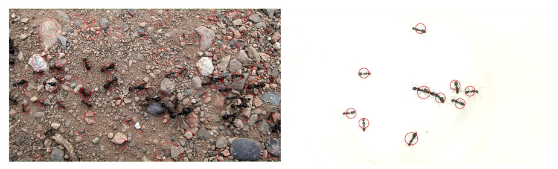

Darrin Gladman, Jehu Osegbe, Wookjin Choi\*, and Joon Suk Lee "Automatic motion tracking system for analysis of insect behavior", Proc. SPIE 11510, Applications of Digital Image Processing XLIII, 115102W (21 August 2020); [https://doi.org/10.1117/12.2568804](https://doi.org/10.1117/12.2568804)

\*Corresponding author

**Abstract**

We present a multi-object tracking system to track small insects such as ants and bees. Motion-based object tracking recognizes the movements of objects in videos using information extracted from the given video frames. We applied several computer vision techniques, such as blob detection and appearance matching, to track ants. Moreover, we discussed different object detection methodologies and investigated the various challenges of object detection, such as illumination variations and blob merge/split. The proposed system effectively tracked multiple objects in various environments.


