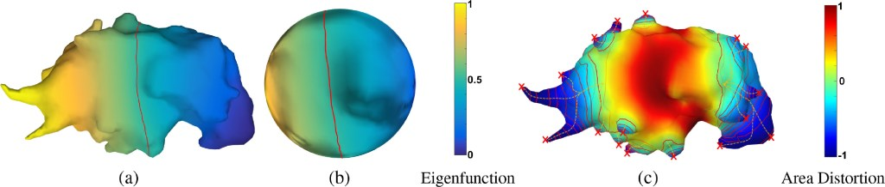

Choi, W., Nadeem, S., Alam, S. R., Deasy, J. O., Tannenbaum, A., & Lu, W. (2020). Reproducible and Interpretable Spiculation Quantification for Lung Cancer Screening. _Computer Methods and Programs in Biomedicine_, 105839. [https://doi.org/10.1016/j.cmpb.2020.105839](https://doi.org/10.1016/j.cmpb.2020.105839)

Source codes: [https://github.com/choilab-jefferson/LungCancerScreeningRadiomics](https://github.com/choilab-jefferson/LungCancerScreeningRadiomics)

  
**Highlights**

- A novel interpretable spiculation feature is presented, computed using the area distortion metric from spherical conformal (angle-preserving) parameterization.

- A simple one-step feature and prediction model is introduced which only uses our interpretable features (size, spiculation, lobulation, vessel/wall attachment) and has the added advantage of using weak-labeled training data.

- A semi-automatic segmentation algorithm is also introduced for more accurate and reproducible lung nodule as well as vessel/wall attachment segmentation. This leads to more accurate spiculation quantification because the attachments can be excluded from spikes on the lung nodule surface (triangular mesh) data.

- Using just our interpretable features (size, attachment, spiculation, lobulation), we were able to achieve AUC=0.82 on public Lung LIDC dataset and AUC=0.76 on public LUNGx dataset (the previous LUNGx best being AUC=0.68).

- State-of-the-art correlation is achieved between our spiculation score (the number of spiculations, _Ns_) and radiologists spiculation score (ρ = 0.44).

**Abstract**

Spiculations are important predictors of lung cancer malignancy, which are spikes on the surface of the pulmonary nodules. In this study, we proposed an interpretable and parameter-free technique to quantify the spiculation using area distortion metric obtained by the conformal (angle-preserving) spherical parameterization. We exploit the insight that for an angle-preserved spherical mapping of a given nodule, the corresponding negative area distortion precisely characterizes the spiculations on that nodule. We introduced novel spiculation scores based on the area distortion metric and spiculation measures. We also semi-automatically segment lung nodule (for reproducibility) as well as vessel and wall attachment to differentiate the real spiculations from lobulation and attachment. A simple pathological malignancy prediction model is also introduced. We used the publicly-available LIDC-IDRI dataset pathologists (strong-label) and radiologists (weak-label) ratings to train and test radiomics models containing this feature, and then externally validate the models. We achieved AUC = 0.80 and 0.76, respectively, with the models trained on the 811 weakly-labeled LIDC datasets and tested on the 72 strongly-labeled LIDC and 73 LUNGx datasets; the previous best model for LUNGx had AUC = 0.68. The number-of-spiculations feature was found to be highly correlated (Spearman’s rank correlation coefficient ) with the radiologists’ spiculation score. We developed a reproducible and interpretable, parameter-free technique for quantifying spiculations on nodules. The spiculation quantification measures was then applied to the radiomics framework for pathological malignancy prediction with reproducible semi-automatic segmentation of nodule. Using our interpretable features (size, attachment, spiculation, lobulation), we were able to achieve higher performance than previous models. In the future, we will exhaustively test our model for lung cancer screening in the clinic.

https://qradiomics.com/2023/11/07/exploring-published-and-novel-pre-treatment-ct-and-pet-radiomics-to-stratify-risk-of-progression-among-early-stage-non-small-cell-lung-cancer-patients-treated-with-stereotactic-radiation/
