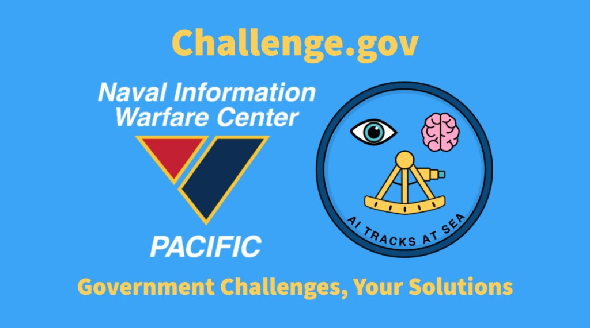
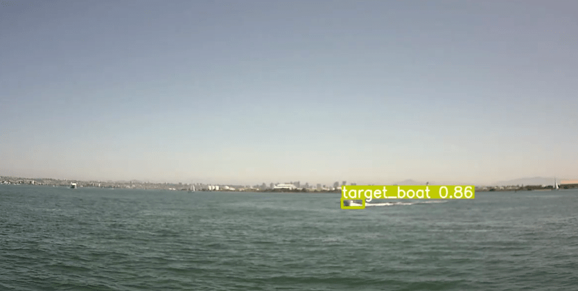
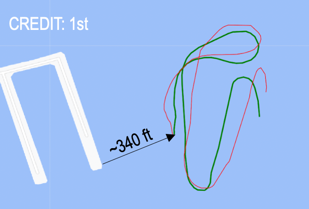

We won 4th place in the Artificial Intelligence (AI) Tracks at Sea Challenge. [https://www.challenge.gov/?challenge=ai-tracks-at-sea](https://www.challenge.gov/?challenge=ai-tracks-at-sea)  
This national competition is organized by the U.S. Navy.

**VSU TrojanOne** Team: Jose Diaz, Curtrell Trott, Advisor: Ju Wang, Wookjin Choi

The $200,000 prize was distributed among five winning teams, which submitted full working solutions, and three runners-up, which submitted partial working solutions. The monetary prize will be awarded to the school the corresponding team attends:

Teams participating in the AI Tracks at Sea Challenge spanned collegiate institutions from east to west U.S. coasts, from both public and private colleges and universities. Collectively, the student submissions for the challenge represent various types of STEM research institutions, Ivy League Schools, Historically Black Colleges and Universities (HBCU) and Hispanic Serving Institutes (HSI). Of the challenge teams, 26% were comprised of students from HBCUs and 16% of the teams attend HSIs.

“With 94% of the competitors attending colleges and universities outside of California, this challenge served as an avenue to make broader impacts in STEM,” said Yolanda Tanner, Naval Information Warfare Systems Command (NAVWAR) STEM Federal Action Officer and NIWC Pacific Internship and Fellowship project manager. “It was also a means by which students could further develop their STEM skills while working collaboratively to solve a real-world naval problem.”

Florida, North Carolina, and Texas had the largest population of participating collegiate teams.

https://www.ccals.com/2021/03/16/vsu-team-takes-fourth-place-in-ai-tracks-at-sea-naval-challenge/
