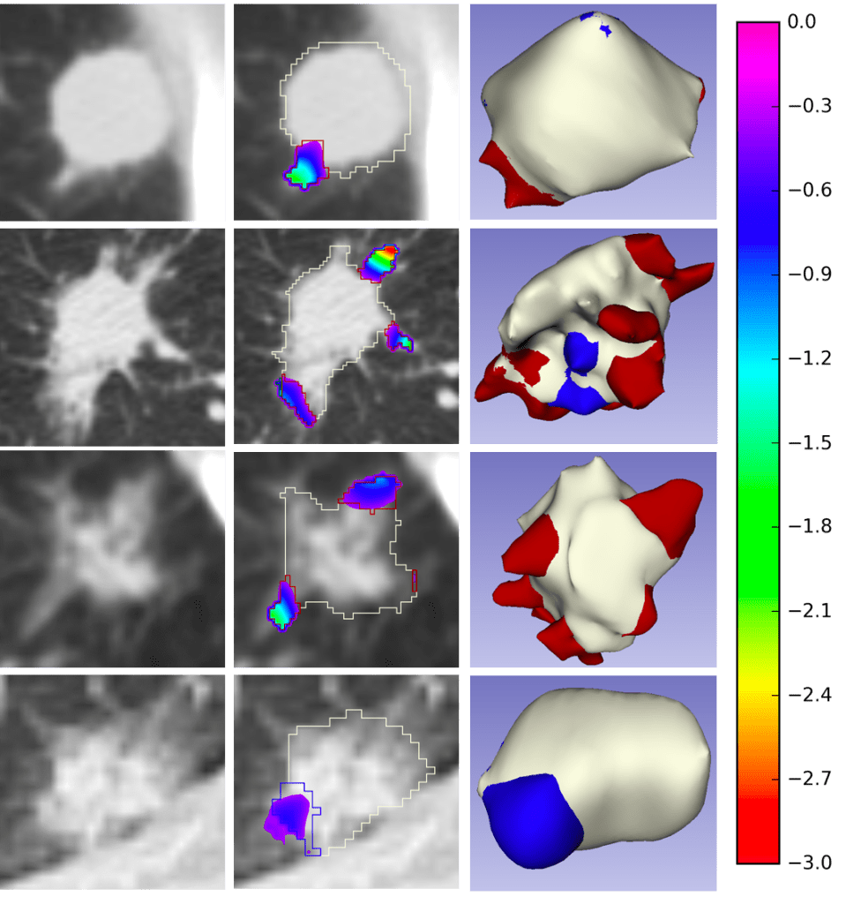
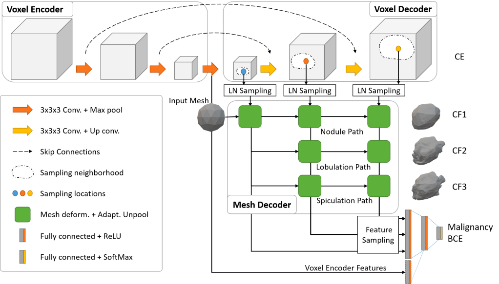

[MICCAI'22 Paper](https://arxiv.org/pdf/2206.14903.pdf) | [CMPB'21 Paper](https://arxiv.org/pdf/1808.08307.pdf) | [CIRDataset](https://zenodo.org/record/6762573)

This library serves as a one-stop solution for analyzing datasets using clinically-interpretable radiomics (CIR) in cancer imaging ([https://github.com/choilab-jefferson/CIR](https://github.com/choilab-jefferson/CIR)). The primary motivation for this comes from our collaborators in radiology and radiation oncology inquiring about the importance of clinically-reported features in state-of-the-art deep learning malignancy/recurrence/treatment response prediction algorithms. Previous methods have performed such prediction tasks but without robust attribution to any clinically reported/actionable features (see extensive literature on the sensitivity of attribution methods to hyperparameters). This motivated us to curate datasets by annotating clinically-reported features at the voxel/vertex level on public datasets (using our published [advanced mathematical algorithms](https://github.com/taznux/LungCancerScreeningRadiomics)) and relating these to prediction tasks (bypassing the “flaky” attribution schemes). With the release of these comprehensively-annotated datasets, we hope that previous malignancy prediction methods can also validate their explanations and provide clinically-actionable insights. We also provide strong end-to-end baselines for extracting these hard-to-compute clinically-reported features and using these in different prediction tasks.

## CIRDataset: A large-scale Dataset for Clinically-Interpretable lung nodule Radiomics and malignancy prediction \[MICCAI'22\]

Wookjin Choi1, Navdeep Dahiya2, and Saad Nadeem3  
1 Department of Radiation Oncology, Thomas Jefferson University Hospital  
2 School of Electrical and Computer Engineering, Georgia Institute of Technology  
3 Department of Medical Physics, Memorial Sloan Kettering Cancer Center

_Spiculations/lobulations, and_ sharp/curved spikes on the surface of lung nodules, are good predictors of lung cancer malignancy and hence, are routinely assessed and reported by radiologists as part of the standardized Lung-RADS clinical scoring criteria. Given the 3D geometry of the nodule and 2D slice-by-slice assessment by radiologists, manual spiculation/lobulation annotation is a tedious task and thus no public datasets exist to date for probing the importance of these clinically-reported features in the SOTA malignancy prediction algorithms. As part of this paper, we release a large-scale Clinically-Interpretable Radiomics Dataset, CIRDataset, containing 956 radiologist QA/QC'ed spiculation/lobulation annotations on segmented lung nodules from two public datasets, LIDC-IDRI (N=883) and LUNGx (N=73). We also present an end-to-end deep learning model based on multi-class Voxel2Mesh extension to segment nodules (while preserving spikes), classify spikes (sharp/spiculation and curved/lobulation), and perform malignancy prediction. Previous methods have performed malignancy prediction for LIDC and LUNGx datasets but without robust attribution to any clinically reported/actionable features (due to known hyperparameter sensitivity issues with general attribution schemes). With the release of this comprehensively-annotated dataset and end-to-end deep learning baseline, we hope that malignancy prediction methods can validate their explanations, benchmark against our baseline, and provide clinically-actionable insights. Dataset, code and pre-trained _models are available in this repository._

### Dataset

The first CIR dataset, released [here](https://zenodo.org/record/6672251), contains almost 1000 radiologist QA/QC’ed spiculation/lobulation annotations (computed using our published [LungCancerScreeningRadiomics](https://github.com/taznux/LungCancerScreeningRadiomics) library and QA/QC'ed by a radiologist) on segmented lung nodules for two public datasets, LIDC (with visual radiologist malignancy RM scores for the entire cohort and pathology-proven malignancy PM labels for a subset) and LUNGx (with pathology-proven size-matched benign/malignant nodules to remove the effect of size on malignancy prediction).

<figure>

<figcaption>

_Clinically-interpretable spiculation/lobulation annotation dataset samples; the first column - input CT image; the second column - overlaid semi-automated/QA/QC'ed contours and superimposed area distortion maps (for quantifying/classifying spikes, computed from spherical parameterization -- see our [LungCancerScreeninigRadiomics Library](https://github.com/taznux/LungCancerScreeningRadiomics)); the third column - 3D mesh model with vertex classifications, red: spiculations, blue: lobulations, white: nodule base._

</figcaption>

</figure>

### End-to-End Deep Learning Nodule Segmentation, Spikes' Classification, and Malignancy Prediction Model

We also release our multi-class [Voxel2Mesh](https://github.com/cvlab-epfl/voxel2mesh) extension to provide a strong benchmark for end-to-end deep learning lung nodule segmentation, spikes’ classification (lobulation/spiculation), and malignancy prediction; Voxel2Mesh is the only published method to our knowledge that preserves sharp spikes during segmentation and hence its use as our base model. With the release of this comprehensively-annotated dataset, we hope that previous malignancy prediction methods can also validate their explanations/attributions and provide clinically-actionable insights. Users can also generate spiculation/lobulation annotations from scratch for LIDC/LUNGx as well as new datasets using our [LungCancerScreeningRadiomics](https://github.com/taznux/LungCancerScreeningRadiomics) library.

<figure>

<figcaption>

_Depiction of end-to-end deep learning architecture based on multi-class Voxel2Mesh extension. The standard UNet based voxel encoder/decoder (top) extracts features from the input CT volumes while the mesh decoder deforms an initial spherical mesh into increasing finer resolution meshes matching the target shape. The mesh deformation utilizes feature vectors sampled from the voxel decoder through the Learned Neighborhood (LN) Sampling technique and also performs adaptive unpooling with increased vertex counts in high curvature areas. We extend the architecture by introducing extra mesh decoder layers for spiculation and lobulation classification. We also sample vertices (shape features) from the final mesh unpooling layer as input to Fully Connected malignancy prediction network. We optionally add deep voxel-features from the last voxel encoder layer to the malignancy prediction network_

</figcaption>

</figure>

### Results

The following tables show the expected results of running the pre-trained 'Mesh Only' and 'Mesh+Encoder' models.

_Table1. Nodule (Class0), spiculation (Class1), and lobulation (Class2) peak classification metrics_

| Training |  |  |  |  |  |  |
| :-: | :-: | :-: | :-: | :-: | :-: | :-: |
| **Network** | Chamfer Weighted Symmetric ↓ |  |  | Jaccard Index ↑ |  |  |
| Class0 | Class1 | Class2 | Class0 | Class1 | Class2 |
| **Mesh Only** | 0.009 | 0.010 | 0.013 | 0.507 | 0.493 | 0.430 |
| **Mesh+Encoder** | 0.008 | 0.009 | 0.011 | 0.488 | 0.456 | 0.410 |
| Validation |  |  |  |  |  |  |
| **Network** | Chamfer Weighted Symmetric ↓ |  |  | Jaccard Index ↑ |  |  |
| Class0 | Class1 | Class2 | Class0 | Class1 | Class2 |
| **Mesh Only** | 0.010 | 0.011 | 0.014 | 0.526 | 0.502 | 0.451 |
| **Mesh+Encoder** | 0.014 | 0.015 | 0.018 | 0.488 | 0.472 | 0.433 |
| Testing LIDC-PM N=72 |  |  |  |  |  |  |
| **Network** | Chamfer Weighted Symmetric ↓ |  |  | Jaccard Index ↑ |  |  |
| Class0 | Class1 | Class2 | Class0 | Class1 | Class2 |
| **Mesh Only** | 0.011 | 0.011 | 0.014 | 0.561 | 0.553 | 0.510 |
| **Mesh+Encoder** | 0.009 | 0.010 | 0.012 | 0.558 | 0.541 | 0.507 |
| Testing LUNGx N=73 |  |  |  |  |  |  |
| **Network** | Chamfer Weighted Symmetric ↓ |  |  | Jaccard Index ↑ |  |  |
| Class0 | Class1 | Class2 | Class0 | Class1 | Class2 |
| **Mesh Only** | 0.029 | 0.028 | 0.030 | 0.502 | 0.537 | 0.545 |
| **Mesh+Encoder** | 0.017 | 0.017 | 0.019 | 0.506 | 0.523 | 0.525 |

_Table 2. Malignancy prediction metrics._

| Training |  |  |  |  |  |
| :-: | :-: | :-: | :-: | :-: | :-: |
| **Network** | AUC | Accuracy | Sensitivity | Specificity | F1 |
| **Mesh Only** | 0.885 | 80.25 | 54.84 | 93.04 | 65.03 |
| **Mesh+Encoder** | 0.899 | 80.71 | 55.76 | 93.27 | 65.94 |
| Validation |  |  |  |  |  |
| **Network** | AUC | Accuracy | Sensitivity | Specificity | F1 |
| **Mesh Only** | 0.881 | 80.37 | 53.06 | 92.11 | 61.90 |
| **Mesh+Encoder** | 0.808 | 75.46 | 42.86 | 89.47 | 51.22 |
| Testing LIDC-PM N=72 |  |  |  |  |  |
| **Network** | AUC | Accuracy | Sensitivity | Specificity | F1 |
| **Mesh Only** | 0.790 | 70.83 | 56.10 | 90.32 | 68.66 |
| **Mesh+Encoder** | 0.813 | 79.17 | 70.73 | 90.32 | 79.45 |
| Testing LUNGx N=73 |  |  |  |  |  |
| **Network** | AUC | Accuracy | Sensitivity | Specificity | F1 |
| **Mesh Only** | 0.733 | 68.49 | 80.56 | 56.76 | 71.60 |
| **Mesh+Encoder** | 0.743 | 65.75 | 86.11 | 45.95 | 71.26 |


