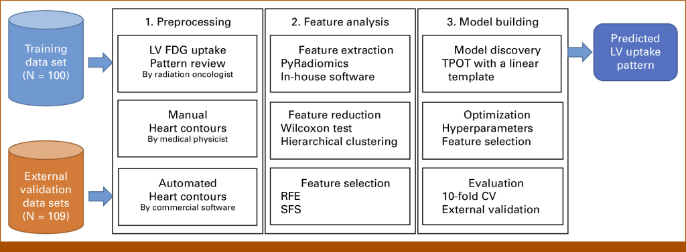
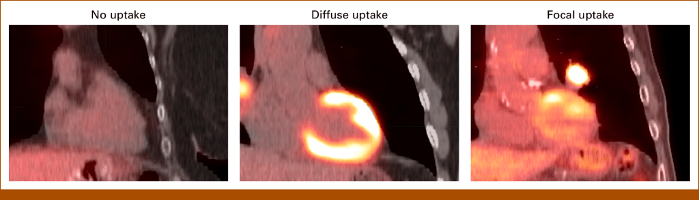

Our paper **“Novel Functional Radiomics for Prediction of Cardiac Positron Emission Tomography Avidity in Lung Cancer Radiotherapy”** has been published in [JCO CCI](https://ascopubs.org/doi/10.1200/CCI.23.00241). This research work delves into an innovative approach to predict clinical cardiac assessment using functional imaging.

> Note: This post summarizes broader **functional cardiac PET radiomics** work. Only one related presentation below is specifically a **delta-radiomics** analysis.

### Abstract:

Traditional methods for evaluating cardiotoxicity primarily focus on radiation doses to the heart. However, functional imaging offers the potential to enhance early prediction of cardiotoxicity in lung cancer patients undergoing radiotherapy. In this context, **Fluorine-18 (18F) fluorodeoxyglucose (FDG)-positron emission tomography (PET)/computed tomography (CT)** imaging plays a crucial role. This study aims to develop a radiomics model that predicts clinical cardiac assessment using 18F-FDG PET/CT scans before thoracic radiation therapy.

### Key Points:

- **Purpose**: To create a radiomics model for predicting clinical cardiac assessment based on 18F-FDG PET/CT scans.

- **Methods**: The study utilized pretreatment 18F-FDG PET/CT scans from three distinct study populations. These populations included two single-institutional protocols and one publicly available dataset.

- **Clinical Classification**: A clinician classified the PET/CT scans according to clinical cardiac guidelines, categorizing them as **no uptake**, **diffuse uptake**, or **focal uptake**.

- **Heart Delineation**: The heart regions were delineated.

- **Novel Radiomics Features**: A total of **210 novel functional radiomics features** were selected to characterize cardiac FDG uptake patterns.

### Results:

The results showed that out of 202 scans, cardiac FDG uptake was scored as no uptake (39.6%), diffuse uptake (25.3%), and focal uptake (35.1%). The researchers reduced sixty-two independent radiomics features to **nine clinically pertinent features**. The best model showed **a predictive accuracy of 93%** in the training data set and **80% and 92%** in two external validation data sets.

### Conclusion:

This study represents a significant advancement by developing and evaluating functional cardiac radiomic features from standard-of-care FDG PET/CT scans. The results demonstrate good predictive accuracy when compared to clinical imaging evaluation.

Feel free to explore the full paper in the **JCO Clinical Cancer Informatics**, Volume 8, available at [this link](https://ascopubs.org/doi/10.1200/CCI.23.00241).

Related Presentations

[Functional Delta-Radiomics Overall Survival Prediction (specific delta-radiomics study)](https://aapm.confex.com/aapm/2023am/meetingapp.cgi/Paper/2188)



[Functional Radiomics Classification of Cardiac Uptake Patterns](https://www.redjournal.org/article/S0360-3016\(23\)05012-5/fulltext)



[https://www.abstractsonline.com/pp8/#!/10856/presentation/7201](https://www.abstractsonline.com/pp8/#!/10856/presentation/7201)


