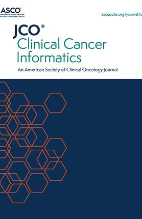

[Our study on cardiac toxicity in lung cancer treatment](https://qradiomics.com/2023/09/11/novel-functional-delta-radiomics-for-predicting-overall-survival-in-lung-cancer-radiotherapy-using-cardiac-fdg-pet-uptake/) is now featured in a JCO CCI editorial. Discoveries that could change patient care are on the horizon. Stay tuned! [#CardiacToxicity](https://www.facebook.com/hashtag/cardiactoxicity?__eep__=6&__cft__[0]=AZVYuNlW1e31uhubkm-E3LkIOc41m_6ws0yeRNQoHoAAfTj9Hi9QyM7eqtYciuE7xVVbG3IeS9lMJZhc5vQuwAwe0Fl1ZEUTpwq3BaIuLOCTmwRfO-88Vg_sIQhl-_kK66nRPi2gNlTw28c-8Pz83HiJDqqdY9Q4k3WScrfQ5YYTpw&__tn__=*NK-R)[#LungCancer](https://www.facebook.com/hashtag/lungcancer?__eep__=6&__cft__[0]=AZVYuNlW1e31uhubkm-E3LkIOc41m_6ws0yeRNQoHoAAfTj9Hi9QyM7eqtYciuE7xVVbG3IeS9lMJZhc5vQuwAwe0Fl1ZEUTpwq3BaIuLOCTmwRfO-88Vg_sIQhl-_kK66nRPi2gNlTw28c-8Pz83HiJDqqdY9Q4k3WScrfQ5YYTpw&__tn__=*NK-R)[#Innovation](https://www.facebook.com/hashtag/innovation?__eep__=6&__cft__[0]=AZVYuNlW1e31uhubkm-E3LkIOc41m_6ws0yeRNQoHoAAfTj9Hi9QyM7eqtYciuE7xVVbG3IeS9lMJZhc5vQuwAwe0Fl1ZEUTpwq3BaIuLOCTmwRfO-88Vg_sIQhl-_kK66nRPi2gNlTw28c-8Pz83HiJDqqdY9Q4k3WScrfQ5YYTpw&__tn__=*NK-R)

[Shining a Light: Unveiling Cardiac Risks Using Positron Emission Tomography Imaging in Lung Cancer Radiotherapy](https://ascopubs.org/doi/10.1200/CCI.24.00045)
