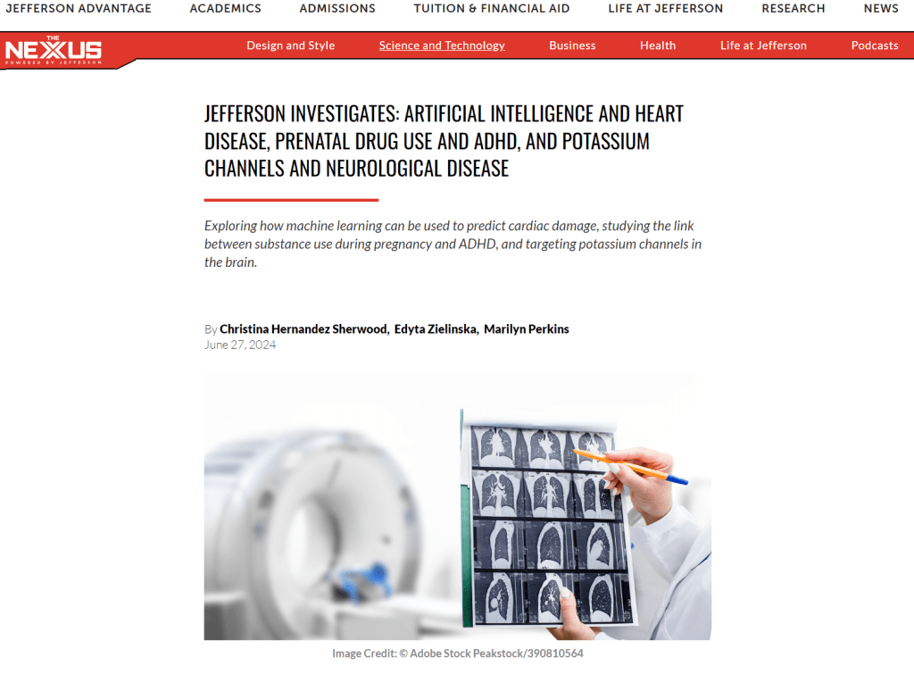

[Jefferson Investigates: Artificial Intelligence and Heart Disease — The Nexus](https://nexus.jefferson.edu/science-and-technology/jefferson-investigates-artificial-intelligence-and-heart-disease-prenatal-drug-use-and-adhd-and-potassium-channels-and-neurological-disease/#lung-scans)

[https://medicalxpress.com/news/2024-06-machine-lung-cancer-scans-heart.html](https://medicalxpress.com/news/2024-06-machine-lung-cancer-scans-heart.html)
