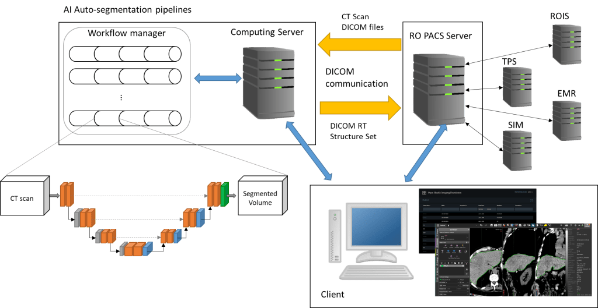

We’re excited to share our latest work published in _Technology in Cancer Research & Treatment_: **“Deep Learning-Based Auto-Segmentation for Liver Yttrium-90 Selective Internal Radiation Therapy”** — a collaboration between Jun Li, Rani Anne, and myself.

This study introduces a **deep learning (DL) model built on the 3D U-Net architecture**, developed to automatically segment the liver in CT scans for patients undergoing Y-90 Selective Internal Radiation Therapy (SIRT). Accurate liver segmentation is a critical step for calculating Y-90 dosage, traditionally done manually — a time-consuming and subjective process.

Our DL-based pipeline:

- **Outperformed Atlas-based methods** (DSC: 0.94 vs. 0.83)

- Achieved near-perfect agreement in dose calculation (RA ~1.00)

- Was deployed clinically using a seamless DICOM workflow

- Processed each case in **under 2 minutes**

This work demonstrates the **clinical viability of AI-assisted planning** in interventional radiology, particularly for liver-directed therapies.

🔗 [Read the full paper here](https://doi.org/10.1177/15330338251327081)
