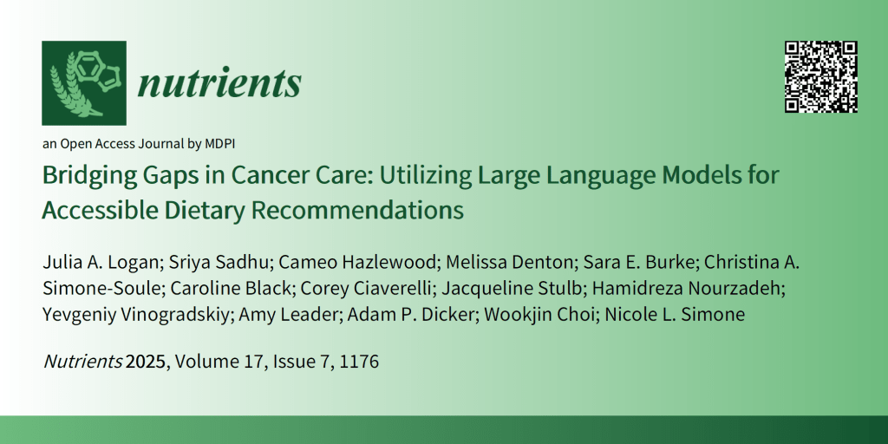
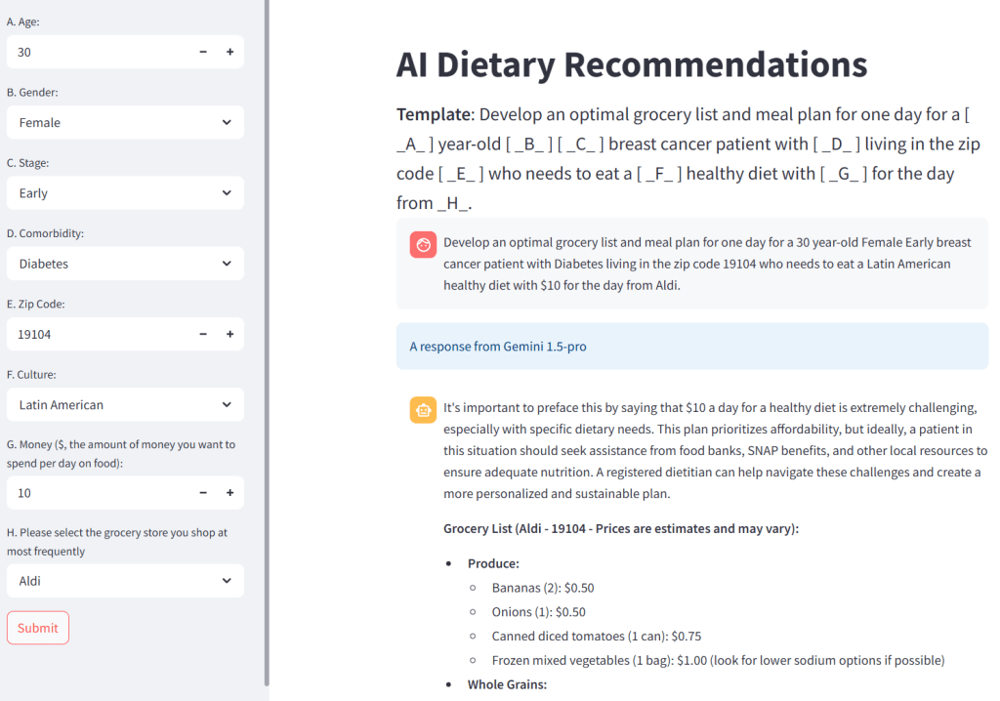

I’m excited to share a new collaborative study I had the privilege of co-authoring, which was recently published in _Nutrients_. Led by Jefferson medical student **Julia Logan**, this work explores how large language models (LLMs) like ChatGPT and Gemini can deliver accessible, culturally sensitive dietary advice to cancer patients—many of whom lack access to professional nutritional counseling due to insurance limitations or socioeconomic barriers.

Working alongside colleagues from the Department of Radiation Oncology at Jefferson, we investigated whether AI tools could generate meal plans tailored to variables like location, budget, and cultural dietary preferences. While LLMs aren't perfect, they showed surprising promise—providing personalized grocery lists and meal suggestions that, in many cases, aligned closely with professional dietitian recommendations.

![Qualitative observations of ChatGPT's and Gemini's responses. (A) Gemini provided photos with linked recipes for some meal plans. Panel (A) is an example of a Gemini-generated image comparable to the one provided, for copyright purposes. ChatGPT did not provide any photos or recipe links. (B) A map from Gemini showing all nearby grocery stores to the zip code specified and another map giving directions to the nearest grocery store. (C) A comparison of breakfast suggestions for Latin American cuisine between the two LLMs. (D) The response of both LLMs to the request for a budget of USD 10 for a day. ChatGPT used language such as "tight budget", suggesting "food assistance programs", while Gemini simply stated that it is possible to achieve a healthy diet.](images/image-2.png)

This project highlights how AI, guided by clinician oversight, can serve as a scalable tool to reduce healthcare disparities and support cancer patients in managing their health more effectively.

🔗 [Read the full paper here](https://www.mdpi.com/2072-6643/17/7/1176)

