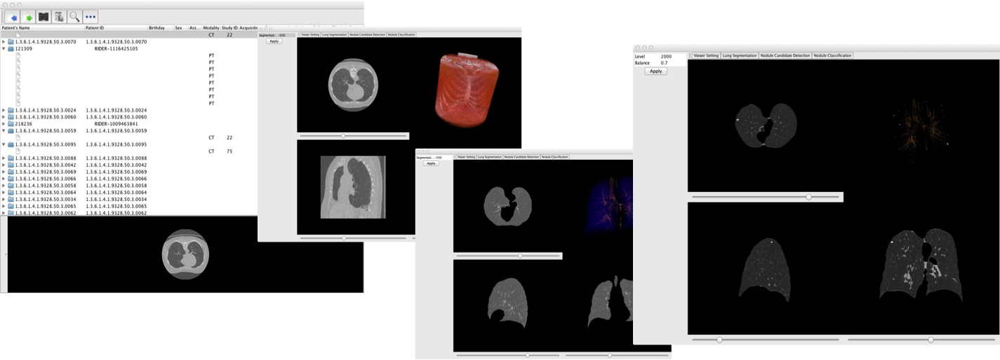

> ⚠️ **This project is no longer maintained.** It has been superseded by [QRadiomics](/qradiomics/), which provides a unified modern Python implementation.

https://github.com/taznux/qualia

QuaLIA (Quantitative Lung Image Analysis)

- Open-source framework for Computer-Aided Detection/Diagnosis
- OSX/Java/ITK/VTK/Gradle

**[QuaLIA CAD](https://github.com/QuaLIACAD/qualia)** [Download Source code](https://github.com/QuaLIACAD/qualia/archive/master.zip)   [Download Binary](https://docs.google.com/uc?export=download&confirm=5MsF&id=0BwUtEL5FMGdzOGtDeU9nWGVGQVU)


