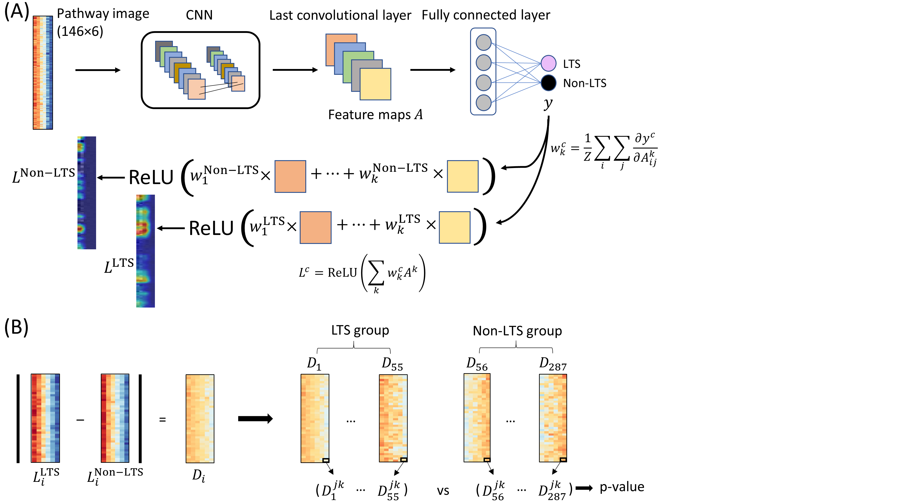

Interpretable convolutional neural networks for survival prediction and pathway analysis applied to glioblastoma

- _Pathway image_: Grid structure conversion for biological array data (a non-grid structured format) for CNNs.
- Interpretation of the CNN model using GradCAM.

Source code: [https://github.com/mskspi/PathCNN](https://github.com/mskspi/PathCNN)

Jung Hun Oh, Wookjin Choi, Euiseong Ko, Mingon Kang, Allen Tannenbaum, Joseph O Deasy, PathCNN: interpretable convolutional neural networks for survival prediction and pathway analysis applied to glioblastoma, _Bioinformatics_, Volume 37, Issue Supplement\_1, July 2021, Pages i443–i450, [https://doi.org/10.1093/bioinformatics/btab285](https://doi.org/10.1093/bioinformatics/btab285)

1. Model Building
    - PathCNN.py
2. GradCAM
    - PathCNN\_GradCAM\_modeling.py: to generate a model for GradCAM (PathCNN\_model.h5)
    - PathCNN\_GradCAM.py: to generate GradCAM images and a resultant file (pathcnn\_gradcam.csv)
3. Multi-omics data
    
    - GBM multi-omics data including mRNA expression, CNV, and DNA methylation were downloaded from the CBioPortal database.
    - Pathway information was downloaded from the KEGG database.
    - PCA was performed for each pathway in individual omics types.
    
    Five PCs in each omics type are in the following files:
    
    - PCA\_EXP.xlsx, PCA\_CNV.xlsx, PCA\_MT.xlsx
    
    Clinival variables are in the following file:
    - Clinical.xlsx
